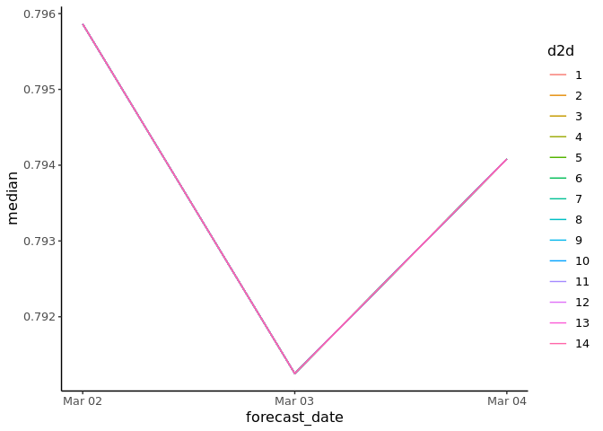
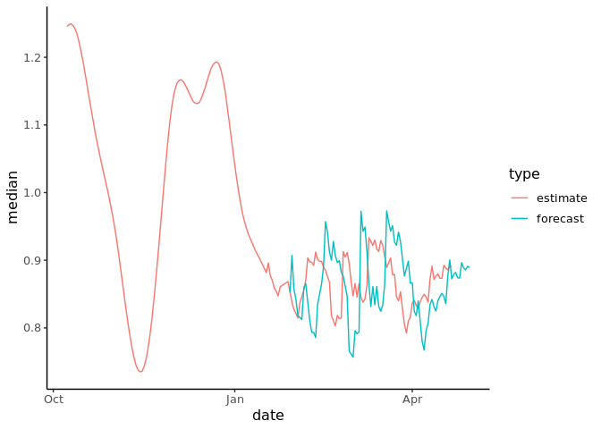

Comparing forecasted COVID-19 RT with estimates
================
Joe Palmer
06/05/2021

Every day the Epiforecasts team produces estimates of COVID-19 cases for
the next 14 days. Snapshots of these forecasts, along with other data,
are stored daily in date marked directories. The objective of this
document is to show a comparison between the forecasted Rt and what the
retrospective estimated ended up as.

`summarised_estimates.rds`, was used as this file shows estimates,
estimates based on partial data and forecasts. To prepare the data I
filtered the summarised estimates for forecasts and estimates for Rt.
This gives 14 forecasts for each date. The estimates are also done on a
rolling basis, with older estimates ommited from newer datasets. To get
around this for the first date we have I grab all the previous estimates
up to that date and on the other dates I grab just the latest estimated
date (1 per dataset). The estimates and forcastes are joind together
giving 15 rows for each date. The first it the retrospective estimate
and the other 14 are forecasts from the previous 14 days.

An issue I ran into here is that as you move through the date files
previous rows listed as estimates often change. It is unclear what one
to use, but I wen’t with the estimate at that time.

### Example data

    ##           date forecast_date variable strat     type    median      mean         sd  lower_90  lower_50  lower_20  upper_20  upper_50  upper_90     region
    ##  1: 2021-03-15    2021-03-01        R  <NA> forecast 0.7566463 0.7580584 0.12087600 0.5625139 0.6848631 0.7309703 0.7834688 0.8334935 0.9514848 Derbyshire
    ##  2: 2021-03-15    2021-03-02        R  <NA> forecast 0.7958625 0.7974508 0.12087817 0.6105447 0.7206102 0.7666738 0.8206613 0.8667077 0.9883866 Derbyshire
    ##  3: 2021-03-15    2021-03-03        R  <NA> forecast 0.7912508 0.7981957 0.12148494 0.6095980 0.7210249 0.7647980 0.8195423 0.8680536 1.0025132 Derbyshire
    ##  4: 2021-03-15    2021-03-04        R  <NA> forecast 0.7940808 0.8036443 0.12433313 0.6215192 0.7228821 0.7665119 0.8236229 0.8740905 1.0183847 Derbyshire
    ##  5: 2021-03-15    2021-03-05        R  <NA> forecast 0.9725297 1.0140550 0.21054197 0.7770372 0.8883478 0.9382795 1.0095235 1.0863816 1.3751583 Derbyshire
    ##  6: 2021-03-15    2021-03-06        R  <NA> forecast 0.9426496 0.9681651 0.15341575 0.7655152 0.8696078 0.9139581 0.9759878 1.0413618 1.2426765 Derbyshire
    ##  7: 2021-03-15    2021-03-07        R  <NA> forecast 0.9491182 0.9701614 0.14456364 0.7793978 0.8762779 0.9204061 0.9829753 1.0407200 1.2307295 Derbyshire
    ##  8: 2021-03-15    2021-03-08        R  <NA> forecast 0.9133338 0.9252254 0.12194093 0.7522659 0.8460543 0.8881581 0.9393357 0.9909178 1.1444049 Derbyshire
    ##  9: 2021-03-15    2021-03-09        R  <NA> forecast 0.8646743 0.8689006 0.10830433 0.7025088 0.7984961 0.8392179 0.8888859 0.9355120 1.0509536 Derbyshire
    ## 10: 2021-03-15    2021-03-10        R  <NA> forecast 0.8314647 0.8346931 0.10051119 0.6759685 0.7738196 0.8096316 0.8540375 0.8931953 1.0002656 Derbyshire
    ## 11: 2021-03-15    2021-03-11        R  <NA> forecast 0.8611043 0.8661346 0.09670618 0.7163423 0.8052939 0.8394337 0.8830486 0.9237384 1.0276440 Derbyshire
    ## 12: 2021-03-15    2021-03-12        R  <NA> forecast 0.8340398 0.8360098 0.09585213 0.6837726 0.7733754 0.8101544 0.8570501 0.8946953 0.9972716 Derbyshire
    ## 13: 2021-03-15    2021-03-13        R  <NA> forecast 0.8612022 0.8667710 0.09354067 0.7241334 0.8061861 0.8397551 0.8826443 0.9223566 1.0215282 Derbyshire
    ## 14: 2021-03-15    2021-03-14        R  <NA> forecast 0.8318243 0.8331302 0.08392262 0.6990165 0.7772400 0.8111223 0.8526808 0.8856014 0.9702254 Derbyshire
    ## 15: 2021-03-15          <NA>        R  <NA> estimate 0.9130579 0.9151682 0.04547751 0.8437492 0.8843012 0.9022162 0.9245010 0.9442857 0.9930054 Derbyshire

The following plot is the forecastes made 1, 2, …, 14 days before the
target date. All the lines overlap, so an estimate 1 and 14 days away
are almost identical and have very little variation. This is weird..

``` r
plt1 <- full %>%
  mutate(
      forecast_date = as.Date(forecast_date),
      d2d = as.factor(date - forecast_date)
  ) %>%
  filter(
      region == "Derbyshire",
      forecast_date >= as.Date("2021-03-02") & forecast_date <= as.Date("2021-03-04")
  ) %>%
  ggplot(aes(x = forecast_date, y = median)) +
  geom_line(aes(colour = d2d))

show(plt1)
```

<!-- -->

This being the case we can pick any to look at.

``` r
full %>%
  mutate(
      forecast_date = as.Date(forecast_date),
      d2d = date - forecast_date
  ) %>%
  filter(
      region == "Derbyshire",
    #   date >= "2021-03-01" & date <= "2021-04-01",
      d2d %in% c(1, NA)
  ) %>%
  ggplot(aes(x = date, y = median, colour = type)) +
  geom_line()
```

<!-- -->

``` r
full %>%
    filter(region == "Manchester", type == "estimate", date > as.Date("2021-03-01"))
```

    ##           date variable strat     type    median      mean         sd  lower_90  lower_50  lower_20  upper_20  upper_50  upper_90 forecast_date     region
    ##  1: 2021-03-02        R  <NA> estimate 1.0051275 1.0079349 0.07447388 0.8916418 0.9556695 0.9872639 1.0243994 1.0571189 1.1362446          <NA> Manchester
    ##  2: 2021-03-03        R  <NA> estimate 1.0191904 1.0210624 0.07343026 0.9057933 0.9694457 0.9999024 1.0382210 1.0701006 1.1439815          <NA> Manchester
    ##  3: 2021-03-04        R  <NA> estimate 1.0515703 1.0540339 0.07678858 0.9317648 1.0013004 1.0331706 1.0712766 1.1030758 1.1837641          <NA> Manchester
    ##  4: 2021-03-05        R  <NA> estimate 1.0781819 1.0818340 0.07529921 0.9591641 1.0296922 1.0611467 1.0978905 1.1322795 1.2093568          <NA> Manchester
    ##  5: 2021-03-06        R  <NA> estimate 1.0667435 1.0698980 0.07366328 0.9534322 1.0187692 1.0484206 1.0845920 1.1179754 1.1985723          <NA> Manchester
    ##  6: 2021-03-07        R  <NA> estimate 1.0764811 1.0778692 0.06756156 0.9687405 1.0313582 1.0588641 1.0936898 1.1218677 1.1917230          <NA> Manchester
    ##  7: 2021-03-08        R  <NA> estimate 1.0692520 1.0706711 0.06623292 0.9654015 1.0262338 1.0538266 1.0861160 1.1142195 1.1803859          <NA> Manchester
    ##  8: 2021-03-09        R  <NA> estimate 1.0293404 1.0302840 0.06804565 0.9209429 0.9850034 1.0120659 1.0462076 1.0755398 1.1414840          <NA> Manchester
    ##  9: 2021-03-10        R  <NA> estimate 1.0009625 1.0008107 0.06806550 0.8870469 0.9571112 0.9844990 1.0195257 1.0463473 1.1092172          <NA> Manchester
    ## 10: 2021-03-11        R  <NA> estimate 0.9832626 0.9823000 0.06891617 0.8666611 0.9381874 0.9655775 1.0019067 1.0289736 1.0909501          <NA> Manchester
    ## 11: 2021-03-12        R  <NA> estimate 0.9984509 0.9958436 0.06968365 0.8772647 0.9511549 0.9815089 1.0147322 1.0427319 1.1077049          <NA> Manchester
    ## 12: 2021-03-13        R  <NA> estimate 1.0374785 1.0366390 0.06618362 0.9271364 0.9936434 1.0200353 1.0527479 1.0804274 1.1447327          <NA> Manchester
    ## 13: 2021-03-14        R  <NA> estimate 1.0387364 1.0370589 0.06463047 0.9301322 0.9948457 1.0227304 1.0543760 1.0801160 1.1415354          <NA> Manchester
    ## 14: 2021-03-15        R  <NA> estimate 0.9919109 0.9906095 0.06715531 0.8775076 0.9467875 0.9754774 1.0090912 1.0367821 1.0983302          <NA> Manchester
    ## 15: 2021-03-16        R  <NA> estimate 1.0267637 1.0257631 0.06503364 0.9202692 0.9825109 1.0109027 1.0425814 1.0678301 1.1323467          <NA> Manchester
    ## 16: 2021-03-17        R  <NA> estimate 1.0217697 1.0219916 0.06370628 0.9175308 0.9785512 1.0049506 1.0389827 1.0651484 1.1265988          <NA> Manchester
    ## 17: 2021-03-19        R  <NA> estimate 1.0020857 1.0015139 0.06580216 0.8928722 0.9569338 0.9857816 1.0195776 1.0451124 1.1067514          <NA> Manchester
    ## 18: 2021-03-21        R  <NA> estimate 0.9532802 0.9527454 0.06564948 0.8434407 0.9096531 0.9369729 0.9691074 0.9962716 1.0601105          <NA> Manchester
    ## 19: 2021-03-22        R  <NA> estimate 0.9162972 0.9156381 0.06521360 0.8075775 0.8707123 0.8989574 0.9330698 0.9618191 1.0227091          <NA> Manchester
    ## 20: 2021-03-23        R  <NA> estimate 0.8650791 0.8639337 0.06639463 0.7539766 0.8196883 0.8485691 0.8814857 0.9080535 0.9714616          <NA> Manchester
    ## 21: 2021-03-24        R  <NA> estimate 0.8398109 0.8396680 0.06607843 0.7304495 0.7971234 0.8234499 0.8569292 0.8832225 0.9475119          <NA> Manchester
    ## 22: 2021-03-25        R  <NA> estimate 0.8173986 0.8168270 0.06541631 0.7094004 0.7737377 0.8008950 0.8341340 0.8599036 0.9234527          <NA> Manchester
    ## 23: 2021-03-26        R  <NA> estimate 0.7498973 0.7493192 0.06802437 0.6357728 0.7046184 0.7318212 0.7670170 0.7952329 0.8580589          <NA> Manchester
    ## 24: 2021-03-28        R  <NA> estimate 0.6736418 0.6726638 0.06735321 0.5627630 0.6271862 0.6564033 0.6898971 0.7186119 0.7815536          <NA> Manchester
    ## 25: 2021-03-29        R  <NA> estimate 0.6914684 0.6910570 0.06480936 0.5837801 0.6474123 0.6741613 0.7070933 0.7349662 0.7961333          <NA> Manchester
    ## 26: 2021-03-30        R  <NA> estimate 0.7317585 0.7329042 0.06357218 0.6292635 0.6904613 0.7159639 0.7477489 0.7747802 0.8383649          <NA> Manchester
    ## 27: 2021-03-31        R  <NA> estimate 0.7804005 0.7807077 0.06542587 0.6783784 0.7365431 0.7632703 0.7952497 0.8227833 0.8911416          <NA> Manchester
    ## 28: 2021-04-01        R  <NA> estimate 0.8304703 0.8319663 0.06827573 0.7241683 0.7856456 0.8135817 0.8464395 0.8762295 0.9486333          <NA> Manchester
    ## 29: 2021-04-02        R  <NA> estimate 0.9039796 0.9078391 0.07655140 0.7893394 0.8553616 0.8840057 0.9231850 0.9566176 1.0401392          <NA> Manchester
    ## 30: 2021-04-03        R  <NA> estimate 0.8928084 0.8987478 0.07336292 0.7892521 0.8475583 0.8753064 0.9125946 0.9438939 1.0261396          <NA> Manchester
    ## 31: 2021-04-04        R  <NA> estimate 0.9385389 0.9425705 0.07453669 0.8272353 0.8908219 0.9200547 0.9574936 0.9920646 1.0706131          <NA> Manchester
    ## 32: 2021-04-05        R  <NA> estimate 0.9523238 0.9557851 0.07243684 0.8416274 0.9065788 0.9336037 0.9706309 1.0029545 1.0770285          <NA> Manchester
    ## 33: 2021-04-06        R  <NA> estimate 0.8852576 0.8865487 0.06613482 0.7810343 0.8410153 0.8682167 0.9003690 0.9293384 0.9996806          <NA> Manchester
    ## 34: 2021-04-07        R  <NA> estimate 0.8665779 0.8698855 0.06403632 0.7689108 0.8273661 0.8509141 0.8840798 0.9119534 0.9792390          <NA> Manchester
    ## 35: 2021-04-08        R  <NA> estimate 0.8956959 0.8984779 0.06231696 0.8013656 0.8557863 0.8807534 0.9111213 0.9379141 1.0049005          <NA> Manchester
    ## 36: 2021-04-09        R  <NA> estimate 0.9111478 0.9117087 0.06002949 0.8167601 0.8712809 0.8959120 0.9250386 0.9506187 1.0119381          <NA> Manchester
    ## 37: 2021-04-10        R  <NA> estimate 1.0113341 1.0124470 0.06697793 0.9036895 0.9663298 0.9951251 1.0286480 1.0570666 1.1231769          <NA> Manchester
    ## 38: 2021-04-11        R  <NA> estimate 0.9852142 0.9873062 0.06394685 0.8879378 0.9412783 0.9682323 1.0014190 1.0298189 1.0974976          <NA> Manchester
    ## 39: 2021-04-12        R  <NA> estimate 0.9960078 0.9979381 0.06439006 0.8966036 0.9522246 0.9791697 1.0126082 1.0408503 1.1060350          <NA> Manchester
    ## 40: 2021-04-13        R  <NA> estimate 0.9961919 0.9972850 0.06009776 0.9029170 0.9542690 0.9799036 1.0116487 1.0378202 1.0993710          <NA> Manchester
    ## 41: 2021-04-14        R  <NA> estimate 0.9598744 0.9607881 0.05802300 0.8681775 0.9226221 0.9466087 0.9744700 0.9989275 1.0560137          <NA> Manchester
    ## 42: 2021-04-15        R  <NA> estimate 0.9109284 0.9094177 0.06012865 0.8090586 0.8732231 0.8969287 0.9245723 0.9491752 1.0047237          <NA> Manchester
    ## 43: 2021-04-16        R  <NA> estimate 0.8361365 0.8328384 0.07321163 0.7089576 0.7831787 0.8171213 0.8549903 0.8843209 0.9459068          <NA> Manchester
    ## 44: 2021-04-17        R  <NA> estimate 0.8634569 0.8591465 0.06704626 0.7425778 0.8167618 0.8467769 0.8795565 0.9057274 0.9608197          <NA> Manchester
    ## 45: 2021-04-18        R  <NA> estimate 0.8261821 0.8238404 0.07017150 0.7031102 0.7769024 0.8084179 0.8445934 0.8730389 0.9345109          <NA> Manchester
    ## 46: 2021-04-19        R  <NA> estimate 0.8494419 0.8469147 0.06587735 0.7346424 0.8037021 0.8333156 0.8659311 0.8925426 0.9501408          <NA> Manchester
    ## 47: 2021-04-20        R  <NA> estimate 0.8956017 0.8940964 0.05965091 0.7960557 0.8547755 0.8804857 0.9094112 0.9331603 0.9903886          <NA> Manchester
    ## 48: 2021-04-21        R  <NA> estimate 0.8926712 0.8917827 0.05943761 0.7932396 0.8531772 0.8779589 0.9069124 0.9318316 0.9879061          <NA> Manchester
    ##           date variable strat     type    median      mean         sd  lower_90  lower_50  lower_20  upper_20  upper_50  upper_90 forecast_date     region

``` r
tst <- full %>%
  mutate(
      forecast_date = as.Date(forecast_date),
      d2d = as.factor(date - forecast_date)
  ) %>%
  filter(
      region == "Derbyshire",
      date >= "2021-03-01" & date <= "2021-04-01",
      d2d  %in% c(1, 2, 3, 4, 5)
  )

tst
```

    ##            date variable strat     type    median      mean         sd  lower_90  lower_50  lower_20  upper_20  upper_50  upper_90 forecast_date     region d2d
    ##   1: 2021-03-01        R  <NA> forecast 0.8760813 0.8765258 0.12436237 0.6761931 0.7999044 0.8460507 0.9023482 0.9528632 1.0735839    2021-02-24 Derbyshire   5
    ##   2: 2021-03-01        R  <NA> forecast 0.8614842 0.8608937 0.12110078 0.6686201 0.7844921 0.8317410 0.8877094 0.9324182 1.0576147    2021-02-25 Derbyshire   4
    ##   3: 2021-03-01        R  <NA> forecast 0.8465528 0.8474580 0.11729309 0.6609764 0.7718055 0.8184289 0.8745414 0.9217897 1.0387607    2021-02-26 Derbyshire   3
    ##   4: 2021-03-01        R  <NA> forecast 0.7657273 0.7597956 0.12315552 0.5501338 0.6843239 0.7355900 0.7931771 0.8393444 0.9502203    2021-02-27 Derbyshire   2
    ##   5: 2021-03-02        R  <NA> forecast 0.8614842 0.8608937 0.12110078 0.6686201 0.7844921 0.8317410 0.8877094 0.9324182 1.0576147    2021-02-25 Derbyshire   5
    ##  ---                                                                                                                                                           
    ## 142: 2021-03-31        R  <NA> forecast 0.8662043 0.8628326 0.09233288 0.7067911 0.8063856 0.8444368 0.8867966 0.9222971 1.0106748    2021-03-30 Derbyshire   1
    ## 143: 2021-04-01        R  <NA> forecast 0.8767275 0.8770920 0.09032007 0.7323417 0.8200165 0.8559278 0.8972593 0.9313672 1.0267922    2021-03-27 Derbyshire   5
    ## 144: 2021-04-01        R  <NA> forecast 0.8987128 0.9005250 0.08860088 0.7573029 0.8455899 0.8788567 0.9181808 0.9553688 1.0508547    2021-03-29 Derbyshire   3
    ## 145: 2021-04-01        R  <NA> forecast 0.8662043 0.8628326 0.09233288 0.7067911 0.8063856 0.8444368 0.8867966 0.9222971 1.0106748    2021-03-30 Derbyshire   2
    ## 146: 2021-04-01        R  <NA> forecast 0.8668285 0.8625574 0.08909670 0.7148288 0.8088108 0.8460099 0.8863903 0.9194261 0.9994849    2021-03-31 Derbyshire   1
